# Claude Code Agentic Coding Assistant

> Claude Code is a stateful, tool-augmented LLM agent where the user prompt, session context, model inference, and tool execution form a closed feedback loop -- understanding each layer and its boundaries is what separates a productive architect from one who fights the system.

## Diagram

```mermaid
flowchart TB
  classDef concept fill:#4A90A4,stroke:#2C5F6E,stroke-width:2px,color:#fff
  classDef process fill:#7B68A6,stroke:#4A3D6E,stroke-width:2px,color:#fff
  classDef example fill:#5DAE8B,stroke:#3D7A5E,stroke-width:2px,color:#fff
  classDef analogy fill:#D4A574,stroke:#A67B4A,stroke-width:2px,color:#fff
  user_layer("User Interface Layer")
  raw_prompt["Raw Prompt"]
  prompt_enrichment["Prompt Enrichment"]
  session_layer("Session Layer")
  context_window("Context Window")
  system_prompt["System Prompt"]
  message_history["Message History"]
  context_compression["Context Compression"]
  claudemd_loader["CLAUDE.md Loader"]
  memory_loader["Memory Loader"]
  permission_state["Permission State"]
  llm_core("LLM Core (Claude Model)")
  inference["Inference and Reasoning"]
  extended_thinking["Extended Thinking"]
  tool_call_emission["Tool Call Emission"]
  parallel_tool_calls["Parallel Tool Call Batching"]
  tool_layer("Tool Execution Layer")
  filesystem_tools["Filesystem Tools"]
  bash_tool["Bash Tool"]
  agent_tool["Agent Tool (Subagent Spawning)"]
  mcp_tools["MCP Server Tools"]
  web_tools["Web Tools"]
  permission_gate("Permission Gate")
  hook_system["Hook System"]
  user_approval["User Approval Prompt"]
  settings_resolver["Settings Resolver"]
  agent_orchestration("Agent Orchestration Layer")
  worktree_isolation["Worktree Isolation"]
  task_tracker["Task Tracker"]
  background_agents["Background Agents"]
  persistence_layer("Persistence Layer")
  memory_writer["Memory Writer"]
  git_layer["Git Layer"]
  settings_persistence["Settings Persistence"]
  class user_layer,session_layer,context_window,llm_core,tool_layer,permission_gate,agent_orchestration,persistence_layer concept
  class raw_prompt,prompt_enrichment,system_prompt,message_history,context_compression,claudemd_loader,memory_loader,permission_state,inference,extended_thinking,tool_call_emission,parallel_tool_calls,filesystem_tools,bash_tool,agent_tool,mcp_tools,web_tools,hook_system,user_approval,settings_resolver,worktree_isolation,task_tracker,background_agents,memory_writer,git_layer,settings_persistence process
  user_layer ==>|submits enriched prompt to| session_layer
  raw_prompt ==>|processed by| prompt_enrichment
  claudemd_loader ==>|injects into| system_prompt
  memory_loader ==>|injects relevant entries into| system_prompt
  session_layer ==>|sends context window to| llm_core
  llm_core ==>|emits tool calls to| tool_layer
  tool_layer -.->|every call gated by| permission_gate
  permission_gate ==>|approves or blocks| tool_layer
  tool_layer ==>|appends results to| context_window
  context_window ==>|re-submitted for next inference| llm_core
  agent_tool ==>|spawns child via| agent_orchestration
  agent_orchestration ---|optionally sandboxes with| worktree_isolation
  settings_resolver ==>|initializes| permission_state
  hook_system ==>|hook output fed back into| context_window
  persistence_layer ==>|loaded at session start into| session_layer
  tool_layer ==>|writes durable state to| persistence_layer

  subgraph Legend
    L1("Concept"):::concept
    L2["Process"]:::process
    L3(["Example"]):::example
    L4{{"Analogy"}}:::analogy
  end
```

## Concepts

- **User Interface Layer** [Concept]
  _The boundary where human intent enters the system -- CLI, IDE extension, Web/Desktop app; all produce the same artifact: a structured prompt sent to the session_
  - **Raw Prompt** [Process]
    _Free-form text typed by the user; may include @file references, !shell commands, /slash commands, or natural language task descriptions_
  - **Prompt Enrichment** [Process]
    _The harness pre-processes the raw prompt before it reaches the LLM: resolves @file references into inline content, expands skill/slash command templates, injects system-reminder tags_

- **Session Layer** [Concept]
  _The stateful container for a single Claude Code interaction -- owns the context window, message history, loaded CLAUDE.md, memory, and tool permission state_
  - **Context Window** [Concept]
    _The LLM's working memory -- a finite token buffer holding system prompt, conversation history, tool results, and injected files; everything the model can see at inference time_
    - **System Prompt** [Process]
      _The harness-injected preamble: Claude's identity, tool schemas, permission rules, CLAUDE.md content, and active memory entries -- assembled fresh each session_
    - **Message History** [Process]
      _Ordered list of user turns, assistant turns, and tool result blocks -- the LLM sees this as a single concatenated token sequence_
    - **Context Compression** [Process]
      _When the context window fills, the harness summarizes older message pairs into a compact synthetic turn -- older tool results are truncated first, then assistant reasoning_
  - **CLAUDE.md Loader** [Process]
    _At session start the harness walks the repo tree, reads CLAUDE.md files (root + active subdirectories), and injects them into the system prompt_
  - **Memory Loader** [Process]
    _Reads ~/.claude/projects/<hash>/MEMORY.md index at session start; injects relevant memory file contents into the system prompt based on description matching_
  - **Permission State** [Process]
    _In-session mutable record of which tool calls are auto-approved, which require user confirmation, and which are blocked -- initialized from settings files, modified by user approvals_

- **LLM Core (Claude Model)** [Concept]
  _The transformer model (claude-sonnet-4-6 / opus-4-6 etc.) that performs all reasoning -- receives the full context window token sequence and produces either a text response or one or more tool call blocks_
  - **Inference and Reasoning** [Process]
    _Single forward pass over the context window -- the model attends to all prior turns, tool results, and injected content simultaneously; no hidden state persists between turns_
  - **Extended Thinking** [Process]
    _Optional scratchpad reasoning tokens generated before the final response -- not shown to the user, used for multi-step decomposition; increases latency but improves complex task accuracy_
  - **Tool Call Emission** [Process]
    _The model outputs structured JSON tool call blocks (name + arguments) instead of plain text when it needs external information or actions -- multiple calls can be batched in one response_
    - **Parallel Tool Call Batching** [Process]
      _The model emits all independent tool calls in a single response block; the harness executes them concurrently and returns all results in one context append -- eliminates sequential round-trip latency_

- **Tool Execution Layer** [Concept]
  _The harness-side subsystem that receives tool call blocks from the LLM, gates them through permission checks, executes them, and appends results back to the context window_
  - **Filesystem Tools** [Process]
    _Read, Write, Edit, Glob, Grep -- operate on the local filesystem; Edit sends only the diff; Glob and Grep use optimized search without shell overhead_
  - **Bash Tool** [Process]
    _Executes arbitrary shell commands in a sandboxed subprocess; working directory persists between calls within a session but shell state (env vars, aliases) does not_
  - **Agent Tool (Subagent Spawning)** [Process]
    _Launches a child Claude Code instance with its own isolated context window and tool set; runs foreground (blocking) or background (async notification); results returned as a single message_
  - **MCP Server Tools** [Process]
    _Model Context Protocol servers extend the tool set with domain-specific capabilities -- the harness connects to configured MCP servers and exposes their tools to the LLM like native tools_
  - **Web Tools** [Process]
    _WebFetch and WebSearch -- allow the LLM to retrieve external URLs or run search queries; results are truncated and appended to context like any other tool result_

- **Permission Gate** [Concept]
  _Every tool call passes through this check before execution: consult permission state, apply settings rules, prompt user if required, run pre-tool hooks; blocks or allows the call_
  - **Hook System** [Process]
    _Shell commands registered in settings.json that fire on harness events: PreToolUse, PostToolUse, Stop, Notification -- the harness runs these, not Claude; output feeds back as context_
  - **User Approval Prompt** [Process]
    _When a tool call exceeds auto-approve scope, the harness pauses execution and presents the call to the user -- approve, deny, or modify; deny is fed back as a tool result to the LLM_
  - **Settings Resolver** [Process]
    _Merges global ~/.claude/settings.json with project .claude/settings.local.json -- project settings override global; determines which tools are auto-approved, blocked, or require confirmation_

- **Agent Orchestration Layer** [Concept]
  _Manages the multi-agent topology: spawning subagents, assigning worktrees, routing background notifications, and aggregating results back to the parent session_
  - **Worktree Isolation** [Process]
    _When isolation=worktree, the harness creates a git worktree branch for the subagent; changes are sandboxed and the branch is returned to the parent or cleaned up automatically_
  - **Task Tracker** [Process]
    _In-session task list (TaskCreate/TaskUpdate/TaskGet) visible to both the LLM and the user -- Claude marks tasks in-progress and completed as it works; survives context compression_
  - **Background Agents** [Process]
    _Subagents launched with run_in_background=true; the parent session continues working and receives an async notification when the child completes -- true parallelism across independent tasks_

- **Persistence Layer** [Concept]
  _Everything that survives session end: CLAUDE.md in the repo, memory files in ~/.claude/projects/, settings files, git history -- the LLM itself has no long-term memory outside these_
  - **Memory Writer** [Process]
    _The LLM writes to memory files via the Write tool on explicit or inferred instruction -- typed files (user, feedback, project, reference) with frontmatter; MEMORY.md is the index_
  - **Git Layer** [Process]
    _All file changes occur within a git repository; the LLM uses Bash tool git commands for commits, diffs, and log -- never force-pushes, never skips hooks without explicit instruction_
  - **Settings Persistence** [Process]
    _settings.json (global) and settings.local.json (project) store permissions, hooks, env vars, and model preferences -- the only durable config the harness reads at startup_

## Relationships

- **User Interface Layer** → *submits enriched prompt to* → **Session Layer**
- **Raw Prompt** → *processed by* → **Prompt Enrichment**
- **CLAUDE.md Loader** → *injects into* → **System Prompt**
- **Memory Loader** → *injects relevant entries into* → **System Prompt**
- **Session Layer** → *sends context window to* → **LLM Core (Claude Model)**
- **LLM Core (Claude Model)** → *emits tool calls to* → **Tool Execution Layer**
- **Tool Execution Layer** → *every call gated by* → **Permission Gate**
- **Permission Gate** → *approves or blocks* → **Tool Execution Layer**
- **Tool Execution Layer** → *appends results to* → **Context Window**
- **Context Window** → *re-submitted for next inference* → **LLM Core (Claude Model)**
- **Agent Tool (Subagent Spawning)** → *spawns child via* → **Agent Orchestration Layer**
- **Agent Orchestration Layer** → *optionally sandboxes with* → **Worktree Isolation**
- **Settings Resolver** → *initializes* → **Permission State**
- **Hook System** → *hook output fed back into* → **Context Window**
- **Persistence Layer** → *loaded at session start into* → **Session Layer**
- **Tool Execution Layer** → *writes durable state to* → **Persistence Layer**

## Real-World Analogies

### Context Window ↔ A whiteboard in a war room that gets erased as it fills up

Every engineer in the room can only work from what is written on the whiteboard right now. When it fills, someone erases the oldest notes and writes a summary. The LLM has the same constraint -- it reasons perfectly over what is visible, but truly cannot recall what was erased. This is why CLAUDE.md and memory files exist: they are the reference docs pinned permanently to the wall.

### Tool Call Emission and Feedback Loop ↔ A senior engineer delegating to specialists and integrating their reports

The LLM does not execute code -- it writes work orders (tool call blocks) handed to the harness. The harness runs the work, writes the results back on the whiteboard, and the LLM reads the updated board to decide what to do next. Each inference turn is a read-decide-delegate cycle, not a continuous execution stream.

### Agent Orchestration Layer ↔ A general dispatching scout platoons with their own radios

The parent Claude session is the general. Each subagent is a scout platoon with its own whiteboard (context window), radio (tool set), and orders (prompt). The platoon reports back a summary -- the general never sees the platoon's entire whiteboard, only the final dispatch. This is how large tasks stay within context limits.

### Permission Gate ↔ A change advisory board (CAB) for production deployments

Low-risk read operations auto-approve like a developer deploying to staging. Write operations or shell commands in sensitive paths trigger a CAB-style pause for human approval. Hooks are the automated compliance checks that run before and after every change, regardless of approval mode.

### Persistence Layer ↔ The difference between RAM and a hard drive

The LLM's weights, the context window, and session state are all RAM -- fast, capable, and gone when the process ends. CLAUDE.md, memory files, git history, and settings.json are the hard drive -- slow to read but durable. Productive architecture means keeping the right things on disk so each new session boots with full context.

---
*Generated on 2026-03-26*