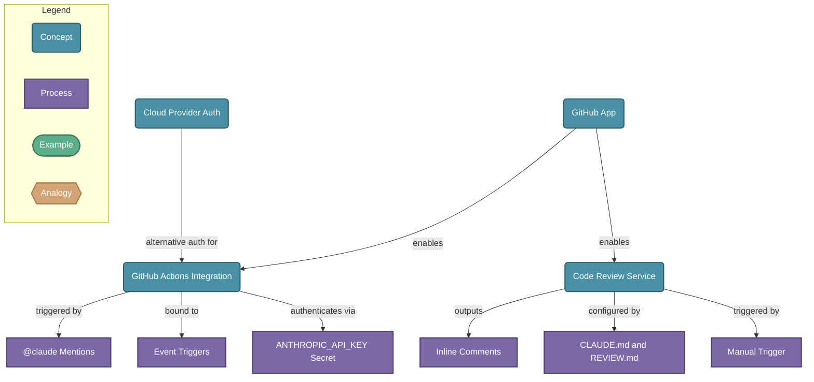

# Claude Code GitHub Integration

> Claude Code integrates with GitHub through Actions and a managed Code Review service, enabling AI-driven automation for PRs, issues, and CI/CD workflows.

## Diagram

## Concepts

- **GitHub App** [Concept]
  _The Claude GitHub App grants permissions to read/write PRs, issues, and files — required for both Actions and Code Review_

- **GitHub Actions Integration** [Concept]
  _A GitHub Action (anthropics/claude-code-action) that lets Claude respond to any GitHub event and take automated actions in your repo_
  - **@claude Mentions** [Process]
    _Trigger Claude by mentioning @claude in PR or issue comments to implement features, fix bugs, or answer questions_
  - **Event Triggers** [Process]
    _Bind Claude to any GitHub event: issue opened, PR pushed, scheduled cron, review comment, etc._
  - **ANTHROPIC_API_KEY Secret** [Process]
    _Store your API key as a GitHub repo secret; Claude uses it to authenticate and run tasks_

- **Code Review Service** [Concept]
  _A managed background service that auto-analyzes every PR diff in context of the full codebase and posts inline review comments_
  - **Inline Comments** [Process]
    _Claude posts findings as inline PR comments on specific lines, ranked by severity (bug, nit, pre-existing)_
  - **CLAUDE.md and REVIEW.md** [Process]
    _Config files that tell Claude what to flag, what style rules to enforce, and what to skip during reviews_
  - **Manual Trigger** [Process]
    _Comment '@claude review' on any PR to trigger an on-demand review_

- **Cloud Provider Auth** [Concept]
  _Claude Actions can authenticate via AWS Bedrock, Google Vertex AI, or Azure using OIDC instead of a direct API key_

## Relationships

- **GitHub App** → *enables* → **GitHub Actions Integration**
- **GitHub App** → *enables* → **Code Review Service**
- **GitHub Actions Integration** → *triggered by* → **@claude Mentions**
- **GitHub Actions Integration** → *bound to* → **Event Triggers**
- **GitHub Actions Integration** → *authenticates via* → **ANTHROPIC_API_KEY Secret**
- **Code Review Service** → *outputs* → **Inline Comments**
- **Code Review Service** → *configured by* → **CLAUDE.md and REVIEW.md**
- **Code Review Service** → *triggered by* → **Manual Trigger**
- **Cloud Provider Auth** → *alternative auth for* → **GitHub Actions Integration**

## Real-World Analogies

### GitHub Actions Integration ↔ A smart on-call engineer

Just like an on-call engineer wakes up when paged, Claude wakes up when triggered by a GitHub event — reads the context, takes action, and posts results — then goes back to sleep.

### Code Review Service ↔ An always-on pair reviewer

Like a senior engineer who automatically reviews every PR you open, the Code Review service silently analyzes each diff and leaves targeted feedback — without you ever having to ask.

### CLAUDE.md and REVIEW.md ↔ A style guide handed to a new hire

Just as you hand a new engineer a style guide so they know what the team cares about, CLAUDE.md and REVIEW.md tell Claude what rules matter in your project so it gives relevant, project-aware feedback.

---
*Generated on 2026-03-26*
