# Claude Code Productive Programmer

> Claude Code is a CLI-first AI coding agent with multiple working environments, context-shaping tools, and productivity patterns that compound when used together -- the key is knowing which lever to pull when.

## Diagram

```mermaid
flowchart TB
  classDef concept fill:#4A90A4,stroke:#2C5F6E,stroke-width:2px,color:#fff
  classDef process fill:#7B68A6,stroke:#4A3D6E,stroke-width:2px,color:#fff
  classDef example fill:#5DAE8B,stroke:#3D7A5E,stroke-width:2px,color:#fff
  classDef analogy fill:#D4A574,stroke:#A67B4A,stroke-width:2px,color:#fff
  env("Working Environments")
  cli["CLI Terminal"]
  ide["IDE Extensions"]
  web["Web and Desktop App"]
  ctx("Context Shaping")
  claudemd["CLAUDE.md"]
  memory["Memory System"]
  fileref["@ File References"]
  compress["Conversation Compression"]
  perms("Permission and Safety Model")
  modes["Permission Modes"]
  hooks["Hooks"]
  settings["settings.json vs settings.local.json"]
  prod("Productivity Patterns")
  plan["Plan Mode"]
  parallel["Parallel Tool Calls"]
  subagent["Subagent Delegation"]
  slash["Slash Commands and Skills"]
  shell["! Shell Passthrough"]
  iter("Task and Iteration Management")
  tasks["TaskCreate and TaskUpdate"]
  worktree["Worktree Isolation"]
  commit["Commit Discipline"]
  class env,ctx,perms,prod,iter concept
  class cli,ide,web,claudemd,memory,fileref,compress,modes,hooks,settings,plan,parallel,subagent,slash,shell,tasks,worktree,commit process
  env ==>|shapes input to| ctx
  claudemd ==>|grounds| prod
  memory ==>|persists across sessions into| ctx
  perms -->|enforced through| hooks
  plan ==>|precedes| iter
  subagent ---|optionally uses| worktree
  settings ==>|configures| modes

  subgraph Legend
    L1("Concept"):::concept
    L2["Process"]:::process
    L3(["Example"]):::example
    L4{{"Analogy"}}:::analogy
  end
```

## Concepts

- **Working Environments** [Concept]
  _CLI terminal, IDE extensions (VS Code/JetBrains), Desktop app, Web app -- all share the same agent core_
  - **CLI Terminal** [Process]
    _Run `claude` for interactive mode or `claude -p 'task'` for one-shot automation; supports piping stdin_
  - **IDE Extensions** [Process]
    _VS Code and JetBrains plugins let Claude see open files and diagnostics without manual path sharing_
  - **Web and Desktop App** [Process]
    _GUI shell for chat-style interaction when outside a terminal context_

- **Context Shaping** [Concept]
  _Claude only knows what is in its context window -- CLAUDE.md, memory, and file reads are the levers_
  - **CLAUDE.md** [Process]
    _Auto-read markdown file for project conventions, architecture decisions, test commands -- highest-leverage setup investment_
  - **Memory System** [Process]
    _Persists MEMORY.md index and typed memory files across sessions -- user preferences, project facts, feedback_
  - **@ File References** [Process]
    _Type @filename in your prompt to inject a specific file into context instantly_
  - **Conversation Compression** [Process]
    _Auto-summarizes older messages as context fills; use /clear for long sessions or subagents for very long tasks_

- **Permission and Safety Model** [Concept]
  _Tiered system -- risky or irreversible tool calls require explicit approval before execution_
  - **Permission Modes** [Process]
    _Default (approve risky actions), auto-approve (all tools), restricted (read-only) -- persist via /update-config_
  - **Hooks** [Process]
    _Shell commands wired to events (pre-tool, post-tool, on-stop) in settings.json -- harness executes them, not Claude_
  - **settings.json vs settings.local.json** [Process]
    _Global: ~/.claude/settings.json; project-local: .claude/settings.local.json -- commit the project file for team-wide sharing_

- **Productivity Patterns** [Concept]
  _The highest-leverage behaviors -- plan mode, parallel calls, and agent delegation are the big three_
  - **Plan Mode** [Process]
    _Use /plan before complex tasks -- Claude proposes approach without executing, align on strategy before any file is touched_
  - **Parallel Tool Calls** [Process]
    _Claude batches independent tool calls in one round-trip -- structure requests for multiple files or searches at once_
  - **Subagent Delegation** [Process]
    _Agent tool spawns Explore/Plan/codebase-explainer subagents for heavy context tasks -- keeps main conversation focused_
  - **Slash Commands and Skills** [Process]
    _Built-in /commit, /review-pr, /clear and user-defined skills provide repeatable automation workflows_
  - **! Shell Passthrough** [Process]
    _Prefix with ! in CLI to run shell commands -- output lands in conversation, useful for auth flows or piping context_

- **Task and Iteration Management** [Concept]
  _Tasks, plan files, and git discipline keep long multi-step sessions recoverable_
  - **TaskCreate and TaskUpdate** [Process]
    _Claude breaks work into discrete tracked tasks -- marks each complete immediately upon finishing_
  - **Worktree Isolation** [Process]
    _isolation=worktree gives agents a sandboxed git worktree -- auto-cleaned if nothing changed; safe for exploratory refactors_
  - **Commit Discipline** [Process]
    _Claude creates new commits after hook fixes, never amends published history, and never commits without explicit instruction_

## Relationships

- **Working Environments** → *shapes input to* → **Context Shaping**
- **CLAUDE.md** → *grounds* → **Productivity Patterns**
- **Memory System** → *persists across sessions into* → **Context Shaping**
- **Permission and Safety Model** → *enforced through* → **Hooks**
- **Plan Mode** → *precedes* → **Task and Iteration Management**
- **Subagent Delegation** → *optionally uses* → **Worktree Isolation**
- **settings.json vs settings.local.json** → *configures* → **Permission Modes**

## Real-World Analogies

### CLAUDE.md ↔ An onboarding doc handed to a new engineer

Just as you hand a new hire a doc covering team conventions and what not to touch -- CLAUDE.md does the same for Claude. Without it, Claude asks questions you have answered a hundred times. With it, Claude starts productive from prompt one.

### Plan Mode ↔ An architect reviewing blueprints before breaking ground

A contractor who skips blueprints and starts building makes expensive mistakes. Plan mode is Claude reviewing blueprints with you -- the cost of misalignment on paper is nearly zero; the cost after code is written is not.

### Subagent Delegation ↔ Sending a junior engineer to do research

Rather than cluttering your main conversation with massive search results, you delegate to a subagent. It returns a clean summary -- the context stays focused and the main task stays on track.

### Permission Modes ↔ sudo vs. a read-only user account

Default mode is like a standard user account -- you approve actions before they hit shared systems. Auto-approve is sudo. Restricted is read-only. Match the mode to the risk of what you are doing, not to convenience.

---
*Generated on 2026-03-26*