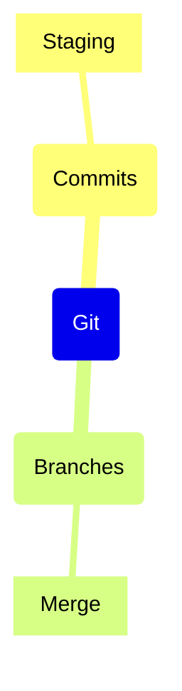

# Git Version Control

> Git is a distributed version control system.

## Diagram

## Concepts

- 💡 **Git**
  Distributed VCS
  - 💡 **Commits**
    Snapshots of code
    - ⚙️ **Staging**
      Prepare changes
  - 💡 **Branches**
    Parallel development
    - ⚙️ **Merge**
      Combine branches

## Relationships

- **Git** → *contains* → **Commits**
- **Git** → *contains* → **Branches**

## Real-World Analogies

### Commits ↔ Save points

Like game saves

---
*Generated on 2026-03-20*