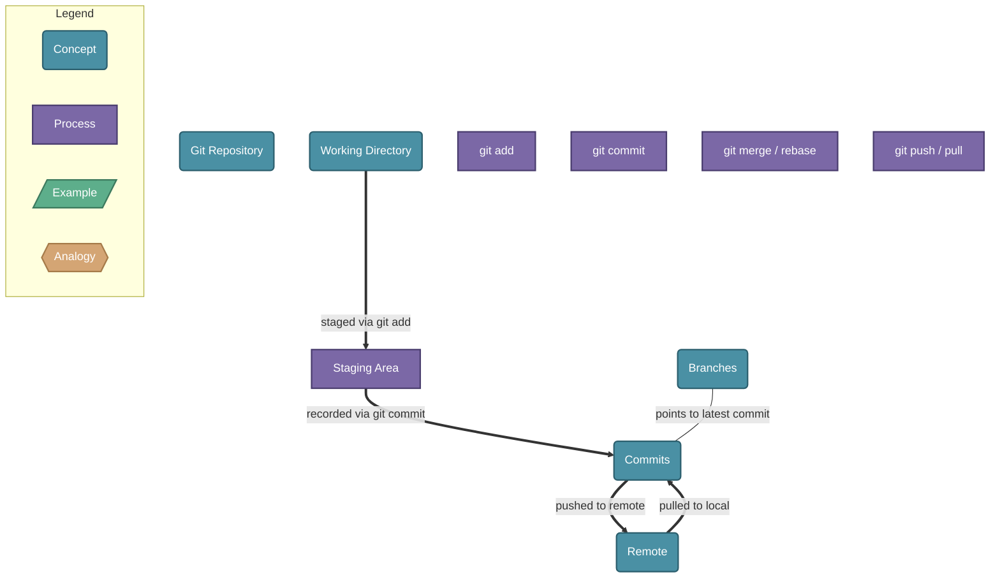

# Git Version Control

> Git is a distributed version control system that tracks changes to files over time, enabling collaboration and full project history.

## Diagram

## Concepts

- **Git Repository** [Concept]
  _A directory tracked by Git, containing the full project history_
  - **Working Directory** [Concept]
    _Local files you edit directly on disk_
  - **Staging Area** [Process]
    _A snapshot of changes prepared for the next commit_
    - **git add** [Process]
      _Move changes from working directory to the staging area_
  - **Commits** [Concept]
    _Permanent, immutable snapshots of the project at a point in time_
    - **git commit** [Process]
      _Record staged changes as a new commit with a message_
  - **Branches** [Concept]
    _Parallel lines of development that diverge from a shared history_
    - **git merge / rebase** [Process]
      _Integrate changes from one branch into another_
  - **Remote** [Concept]
    _A hosted copy of the repository (e.g., GitHub) for sharing and backup_
    - **git push / pull** [Process]
      _Sync commits between local repo and remote_

## Relationships

- **Working Directory** → *staged via git add* → **Staging Area**
- **Staging Area** → *recorded via git commit* → **Commits**
- **Branches** → *points to latest commit* → **Commits**
- **Commits** → *pushed to remote* → **Remote**
- **Remote** → *pulled to local* → **Commits**

## Real-World Analogies

### Commits ↔ Save points in a video game

Just as a save point records your exact game state so you can return to it later, a commit records the exact state of your files — letting you revisit or restore any version in history.

### Staging Area ↔ A shopping cart

Like adding items to a cart before checking out, you stage changes before committing. This gives you a chance to review exactly what goes into the next snapshot before making it permanent.

### Branches ↔ Parallel timelines

Each branch is an independent timeline of your project. You can experiment freely on a feature branch without affecting main — and merge the timelines together when ready.

---
*Generated on 2026-03-20*