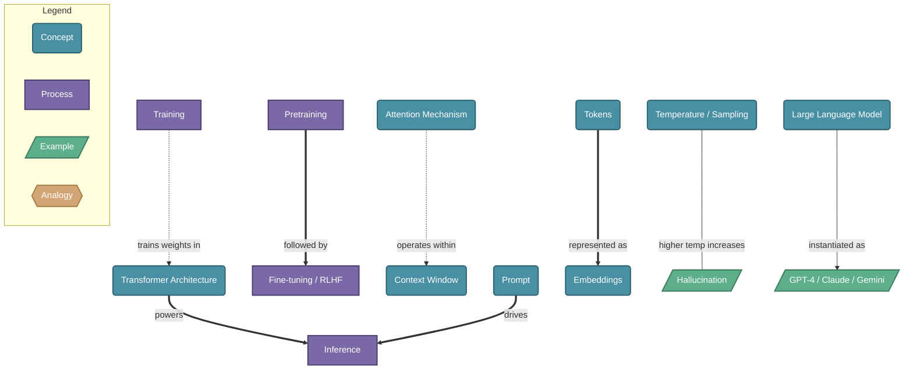

# Large Language Models (LLMs)

> LLMs are neural networks trained on massive text datasets to predict and generate human-like text, enabling tasks like conversation, summarization, coding, and reasoning.

## Diagram

## Concepts

- **Large Language Model** [Concept]
  _A neural network with billions of parameters trained to understand and generate text by predicting the next token_
  - **Training** [Process]
    _The process of adjusting model weights on vast text data so the model learns language patterns_
    - **Pretraining** [Process]
      _Initial training on a huge corpus (web, books, code) to predict masked or next tokens — builds general knowledge_
    - **Fine-tuning / RLHF** [Process]
      _Further training on curated data + human feedback to align the model with helpful, safe behavior_
  - **Transformer Architecture** [Concept]
    _The neural network design underlying most LLMs, built on attention mechanisms that relate every token to every other token_
    - **Attention Mechanism** [Concept]
      _Allows the model to weigh the relevance of each token relative to all others — the core of the Transformer_
    - **Context Window** [Concept]
      _The maximum number of tokens the model can consider at once — determines how much text it can 'see' at a time_
  - **Inference** [Process]
    _Using a trained model to generate responses — the model predicts one token at a time given a prompt_
    - **Temperature / Sampling** [Concept]
      _Controls randomness during generation — low temperature = deterministic, high = creative/varied_
    - **Prompt** [Concept]
      _The input text that steers the model's output — includes instructions, context, and examples_
    - **Hallucination** [Example]
      _When the model generates confident-sounding but factually incorrect output — a key limitation_
  - **Tokens** [Concept]
    _The basic units of text LLMs operate on — roughly word fragments (e.g., 'running' = ['run', '##ning'])_
    - **Embeddings** [Concept]
      _Dense numeric vectors representing tokens; similar meanings cluster together in this high-dimensional space_
  - **GPT-4 / Claude / Gemini** [Example]
    _Prominent LLM products built on these principles, each with different architectures and training approaches_

## Relationships

- **Training** → *trains weights in* → **Transformer Architecture**
- **Pretraining** → *followed by* → **Fine-tuning / RLHF**
- **Transformer Architecture** → *powers* → **Inference**
- **Tokens** → *represented as* → **Embeddings**
- **Attention Mechanism** → *operates within* → **Context Window**
- **Prompt** → *drives* → **Inference**
- **Temperature / Sampling** → *higher temp increases* → **Hallucination**
- **Large Language Model** → *instantiated as* → **GPT-4 / Claude / Gemini**

## Real-World Analogies

### Large Language Model ↔ An incredibly well-read autocomplete

Imagine someone who has read virtually all text ever written and can instantly predict what word comes next — not by retrieving stored sentences, but by having internalized the patterns of language so deeply they can compose original text on any topic. LLMs work the same way: they don't look things up, they generate based on learned statistical patterns.

### Attention Mechanism ↔ Highlighting a document while reading

When you read 'The trophy didn't fit in the suitcase because it was too big', you mentally highlight 'trophy' as the referent of 'it'. The attention mechanism does this computationally — for every token it generates, it assigns relevance weights to all other tokens in the context, letting it resolve ambiguity and capture long-range dependencies.

### Fine-tuning / RLHF ↔ An intern completing an apprenticeship

Pretraining is like graduating from university — broad knowledge but raw. Fine-tuning with human feedback is the apprenticeship: a senior (human rater) evaluates responses and steers the intern toward professional norms, until the behavior becomes internalized without needing constant supervision.

---
*Generated on 2026-03-20*