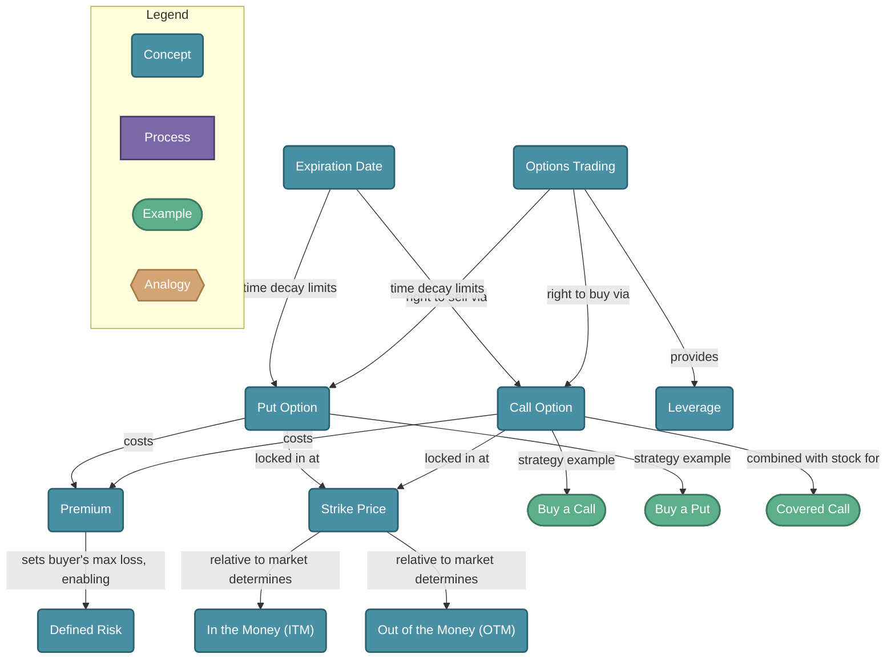

# Options Trading

> An option is a contract giving you the right — but not the obligation — to buy or sell an asset at a fixed price before a set date. Options enable leverage, hedging, and income strategies that aren't possible with stocks alone.

## Diagram

## Concepts

- **Options Trading** [Concept]
  _Buying and selling contracts that give the right (not obligation) to buy or sell an asset at a fixed price before expiration. Used for speculation, hedging, and income._
  - **Call Option** [Concept]
    _The right to **buy** an asset at the strike price before expiration. You profit when the underlying asset rises above the strike + premium paid._
    - **Buy a Call** [Example]
      _You buy a call on Apple at a $150 strike for $5 premium. If Apple rises to $170, your option is worth at least $20 — a 4x return on the premium._
  - **Put Option** [Concept]
    _The right to **sell** an asset at the strike price before expiration. You profit when the underlying asset falls below the strike − premium paid._
    - **Buy a Put** [Example]
      _You buy a put on a stock at $100 strike for $3. If the stock crashes to $70, your put is worth at least $30 — protection or profit from the decline._
  - **Premium** [Concept]
    _The price you pay to purchase an option contract. It's your maximum loss as a buyer. Sellers collect the premium upfront but take on open-ended risk._
  - **Strike Price** [Concept]
    _The fixed price at which you can buy (call) or sell (put) the underlying asset. The relationship between strike and current price determines intrinsic value._
  - **Expiration Date** [Concept]
    _The date the contract expires. Options lose value as expiration approaches (time decay / theta). Weekly, monthly, and LEAPS (year+) expirations exist._
  - **In the Money (ITM)** [Concept]
    _A call is ITM when stock price > strike. A put is ITM when stock price < strike. ITM options have intrinsic value and are worth exercising._
  - **Out of the Money (OTM)** [Concept]
    _A call is OTM when stock price < strike. A put is OTM when stock price > strike. OTM options have no intrinsic value — only time value remaining._
  - **Covered Call** [Example]
    _You own 100 shares of a stock and sell a call against them. You collect the premium as income. If the stock stays flat or rises modestly, you profit. If it surges past the strike, your upside is capped._
  - **Leverage** [Concept]
    _One option contract controls 100 shares. A small premium can generate outsized returns (or losses) relative to the capital deployed._
  - **Defined Risk** [Concept]
    _As an option buyer, your maximum loss is always the premium paid — you can never lose more. This makes options safer than futures or margin for buyers._

## Relationships

- **Options Trading** → *right to buy via* → **Call Option**
- **Options Trading** → *right to sell via* → **Put Option**
- **Call Option** → *costs* → **Premium**
- **Put Option** → *costs* → **Premium**
- **Premium** → *sets buyer's max loss, enabling* → **Defined Risk**
- **Call Option** → *locked in at* → **Strike Price**
- **Put Option** → *locked in at* → **Strike Price**
- **Strike Price** → *relative to market determines* → **In the Money (ITM)**
- **Strike Price** → *relative to market determines* → **Out of the Money (OTM)**
- **Expiration Date** → *time decay limits* → **Call Option**
- **Expiration Date** → *time decay limits* → **Put Option**
- **Call Option** → *strategy example* → **Buy a Call**
- **Put Option** → *strategy example* → **Buy a Put**
- **Call Option** → *combined with stock for* → **Covered Call**
- **Options Trading** → *provides* → **Leverage**

## Real-World Analogies

### Call Option ↔ A coupon for a fixed price

Imagine a coupon that lets you buy a TV for $500, valid for 30 days. If the TV's price rises to $700, the coupon is very valuable — you can buy at $500 and immediately save $200. If the TV stays at $450, you ignore the coupon and it expires worthless. The cost of the coupon is the premium.

### Put Option ↔ Insurance on your car

You pay an insurance premium each month. If your car gets totaled (value drops to zero), you collect a payout. If nothing bad happens, you lose the premium — but that peace of mind was worth it. A put option works the same way: pay a premium to protect against a stock's decline.

### Time Decay ↔ A melting ice cube

An option's time value shrinks every day — like an ice cube melting in your hand. The closer to expiration, the faster it melts. Buyers race against this clock; sellers are happy to let time pass and collect the melt.

---
*Generated on 2026-03-21*
