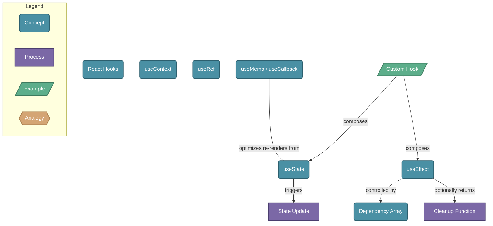

# React Hooks

> React Hooks are functions that let function components tap into React state and lifecycle features without writing a class.

## Diagram

## Concepts

- **React Hooks** [Concept]
  _Functions prefixed with 'use' that connect function components to React's internal systems_
  - **useState** [Concept]
    _Adds local state to a component; returns current value and a setter function_
    - **State Update** [Process]
      _Calling the setter schedules a re-render with the new value_
  - **useEffect** [Concept]
    _Runs side effects (data fetching, subscriptions, DOM updates) after render_
    - **Dependency Array** [Concept]
      _Controls when useEffect re-runs: empty = once, omitted = every render, [dep] = when dep changes_
    - **Cleanup Function** [Process]
      _Returned from useEffect to cancel subscriptions or timers when component unmounts_
  - **useContext** [Concept]
    _Reads a React context value without wrapping in a consumer component_
  - **useRef** [Concept]
    _Holds a mutable value that persists across renders without triggering re-renders_
  - **useMemo / useCallback** [Concept]
    _Memoize expensive values or functions to avoid unnecessary recalculation_
  - **Custom Hook** [Example]
    _A function that composes built-in hooks to encapsulate and reuse stateful logic_

## Relationships

- **useState** → *triggers* → **State Update**
- **useEffect** → *controlled by* → **Dependency Array**
- **useEffect** → *optionally returns* → **Cleanup Function**
- **Custom Hook** → *composes* → **useState**
- **Custom Hook** → *composes* → **useEffect**
- **useMemo / useCallback** → *optimizes re-renders from* → **useState**

## Real-World Analogies

### useState ↔ A whiteboard with an eraser

useState gives your component its own whiteboard to write values on. When you erase and rewrite (call the setter), everyone looking at the whiteboard (the UI) sees the update immediately.

### useEffect ↔ A motion-activated light

The light (effect) runs when something changes (dependency array). It also has a cleanup: when you leave the room (unmount), the light turns off automatically — just like the cleanup function cancels subscriptions.

### Custom Hook ↔ A power strip

Instead of plugging each device directly into the wall outlet (composing hooks inline everywhere), a custom hook is a power strip — one reusable module that bundles multiple connections and plugs into any component that needs them.

---
*Generated on 2026-03-20*