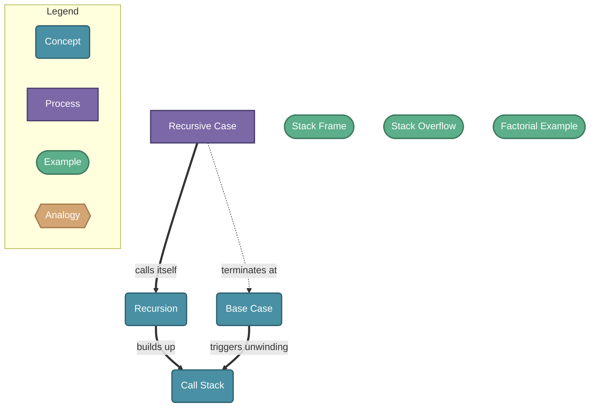

# Recursion

> Recursion is a technique where a function solves a problem by calling itself on progressively smaller subproblems until reaching a base case that can be solved directly.

## Diagram

## Concepts

- **Recursion** [Concept]
  _A function that calls itself to solve a smaller version of the same problem_
  - **Base Case** [Concept]
    _The stopping condition — a simple input solved directly without another recursive call_
  - **Recursive Case** [Process]
    _Breaks the problem into a smaller version and calls the function again_
    - **Factorial Example** [Example]
      _factorial(n) = n * factorial(n-1), base case: factorial(0) = 1_
  - **Call Stack** [Concept]
    _The stack of pending function calls built up during recursion, unwound on each return_
    - **Stack Frame** [Example]
      _One entry in the call stack representing a single invocation with its own local state_
    - **Stack Overflow** [Example]
      _Error when recursion is too deep and the call stack runs out of memory_

## Relationships

- **Recursive Case** → *calls itself* → **Recursion**
- **Recursive Case** → *terminates at* → **Base Case**
- **Recursion** → *builds up* → **Call Stack**
- **Base Case** → *triggers unwinding* → **Call Stack**

## Real-World Analogies

### Recursion ↔ Russian nesting dolls

Each doll contains a smaller version of itself. Opening a doll (a recursive call) reveals another doll, until you reach the smallest one with nothing inside (the base case). Closing them back up mirrors the return journey up the call stack.

### Call Stack ↔ A stack of plates

Each plate represents a function call. You add a plate for every recursive call and remove the top plate when it returns — last in, first out. Too many plates and the stack collapses (stack overflow).

### Base Case ↔ The bottom of a staircase

No matter how many stairs you walk down, you eventually reach the floor and stop descending. The base case is that floor — the point where you stop recursing and start returning answers back up.

---
*Generated on 2026-03-20*