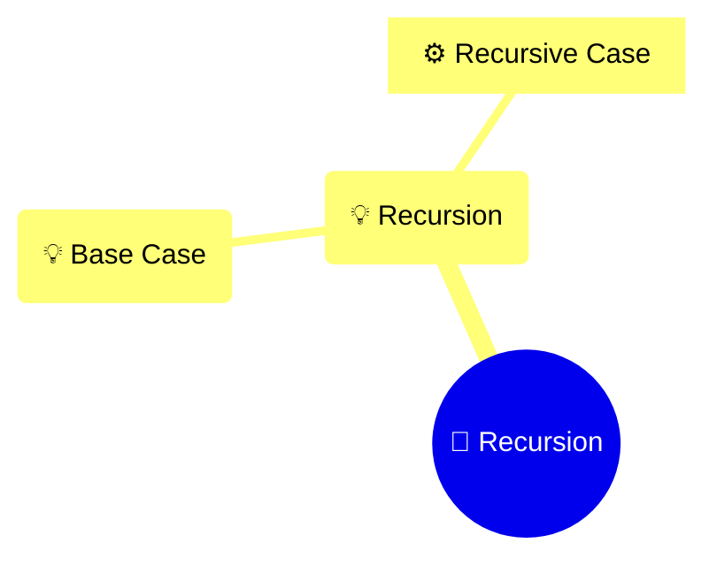

# Recursion

> A function that calls itself.

## Diagram

## Concepts

- 💡 **Recursion**
  Calls itself
  - 💡 **Base Case**
    Stop condition
  - ⚙️ **Recursive Case**
    Smaller input

## Real-World Analogies

### Recursion ↔ Russian dolls

Each contains a smaller version

---
*Generated on 2026-03-20*