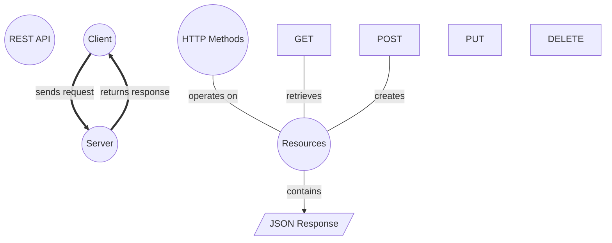

# REST API Architecture

> REST (Representational State Transfer) is an architectural style for designing networked applications using stateless, client-server communication over HTTP.

## Diagram

## Concepts

- 💡 **REST API**
  Architectural style for web services
  - 💡 **Client**
    Makes requests to the server
  - 💡 **Server**
    Processes requests and returns responses
  - 💡 **HTTP Methods**
    GET, POST, PUT, DELETE operations
    - ⚙️ **GET**
      Retrieve a resource
    - ⚙️ **POST**
      Create a new resource
    - ⚙️ **PUT**
      Update an existing resource
    - ⚙️ **DELETE**
      Remove a resource
  - 💡 **Resources**
    Data entities identified by URLs
    - 📝 **JSON Response**
      Data format for API responses

## Relationships

- **Client** → *sends request* → **Server**
- **Server** → *returns response* → **Client**
- **HTTP Methods** → *operates on* → **Resources**
- **Resources** → *contains* → **JSON Response**
- **GET** → *retrieves* → **Resources**
- **POST** → *creates* → **Resources**

## Real-World Analogies

### REST API ↔ Restaurant ordering

Like a restaurant where you (client) give your order to a waiter (HTTP), who takes it to the kitchen (server) and brings back your food (response). The menu lists available dishes (resources), and you can order (GET), request custom dishes (POST), modify orders (PUT), or cancel (DELETE).

### Resources ↔ Library books

Each book has a unique call number (URL) that identifies it. You can check out (GET), donate new books (POST), replace damaged copies (PUT), or remove outdated books (DELETE).

### Stateless ↔ Vending machine

Each transaction is independent - the machine does not remember your previous purchases. Every request must contain all information needed to complete it.

---
*Generated on 2026-03-20*