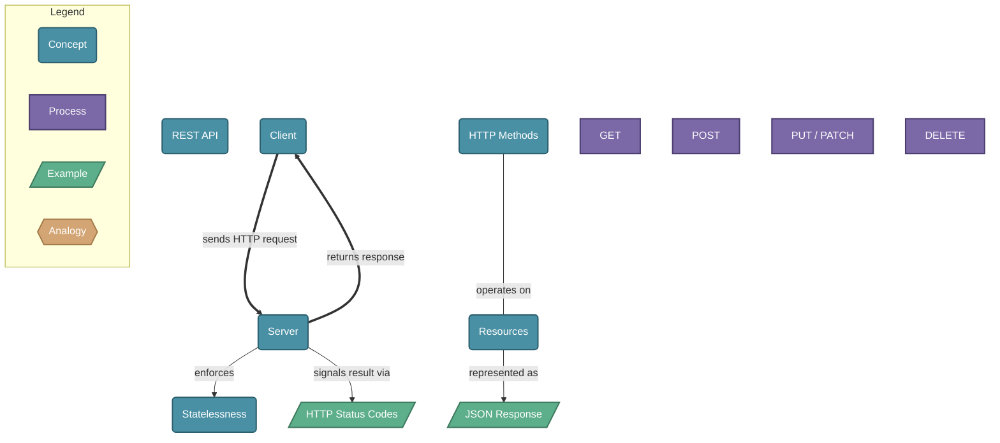

# REST API Architecture

> REST (Representational State Transfer) is an architectural style for networked applications using stateless, client-server communication over HTTP.

## Diagram

## Concepts

- **REST API** [Concept]
  _An API that follows REST constraints: stateless, client-server, uniform interface_
  - **Client** [Concept]
    _The consumer that makes requests — a browser, mobile app, or another service_
  - **Server** [Concept]
    _Processes requests, applies business logic, and returns responses_
    - **HTTP Status Codes** [Example]
      _Numeric codes communicating the result: 200 OK, 404 Not Found, 500 Server Error_
  - **HTTP Methods** [Concept]
    _Verbs that define the intended action on a resource_
    - **GET** [Process]
      _Retrieve a resource without modifying it_
    - **POST** [Process]
      _Create a new resource_
    - **PUT / PATCH** [Process]
      _Replace or partially update an existing resource_
    - **DELETE** [Process]
      _Remove a resource_
  - **Resources** [Concept]
    _Entities identified by URLs — the nouns of the API (e.g., /users, /orders)_
    - **JSON Response** [Example]
      _The common data format returned by the server, carrying resource state_
  - **Statelessness** [Concept]
    _Each request must contain all information needed; the server holds no session state_

## Relationships

- **Client** → *sends HTTP request* → **Server**
- **Server** → *returns response* → **Client**
- **HTTP Methods** → *operates on* → **Resources**
- **Resources** → *represented as* → **JSON Response**
- **Server** → *enforces* → **Statelessness**
- **Server** → *signals result via* → **HTTP Status Codes**

## Real-World Analogies

### REST API ↔ A restaurant

You (client) read the menu (API docs), give your order to a waiter (HTTP request), and the kitchen (server) prepares and delivers your food (response). The menu lists what is available (resources), and you can order existing dishes (GET), request a new item (POST), swap a dish (PUT), or cancel (DELETE).

### Resources ↔ Library books with call numbers

Each book has a unique call number (URL) that identifies exactly where it is. You can check it out (GET), donate a new copy (POST), replace a damaged edition (PUT), or remove it from circulation (DELETE).

### Statelessness ↔ A vending machine

Every transaction is fully self-contained — the machine does not remember what you bought last time. Each request must carry all the context needed (authentication, parameters) for the server to process it independently.

---
*Generated on 2026-03-20*