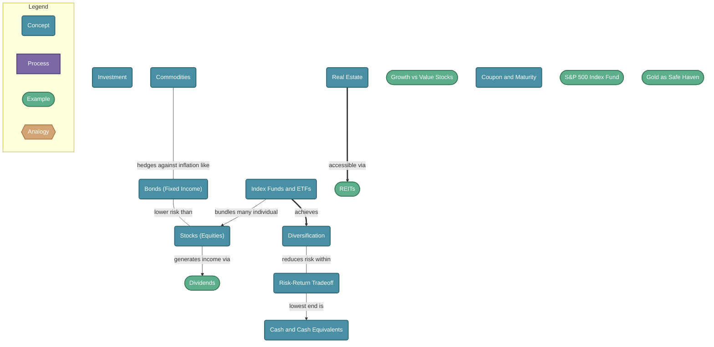

# Types of Investments

> Investments are assets you put money into expecting a return. Different asset classes carry different risk, return potential, and roles in a portfolio — understanding each helps you build a strategy suited to your goals.

## Diagram

## Concepts

- **Investment** [Concept]
  _Putting money to work in an asset with the expectation of generating a return over time_
  - **Stocks (Equities)** [Concept]
    _Ownership shares in a company. You profit if the company grows (price appreciation) or distributes profits (dividends). High risk, high return potential._
    - **Dividends** [Example]
      _Portion of company profits paid to shareholders — a regular income stream on top of price appreciation_
    - **Growth vs Value Stocks** [Example]
      _Growth stocks reinvest all profits (high upside, no dividend). Value stocks are underpriced relative to fundamentals (safer, often pay dividends)._
  - **Bonds (Fixed Income)** [Concept]
    _Loans you make to governments or companies. They pay you regular interest (coupon) and return principal at maturity. Lower risk, lower return._
    - **Coupon and Maturity** [Concept]
      _Coupon = periodic interest payment. Maturity = date principal is returned. Bond prices move inversely with interest rates._
  - **Index Funds and ETFs** [Concept]
    _Baskets of many assets (stocks, bonds, etc.) that track a market index. Instant diversification at low cost._
    - **S&P 500 Index Fund** [Example]
      _Tracks the 500 largest US companies. Historically returns ~10% per year on average. The benchmark most active managers fail to beat._
    - **Diversification** [Concept]
      _Spreading investments across uncorrelated assets reduces risk — if one falls, others may hold steady or rise_
  - **Commodities** [Concept]
    _Physical goods — gold, oil, wheat, copper. Prices driven by supply and demand. Used as inflation hedges or speculation._
    - **Gold as Safe Haven** [Example]
      _Gold holds value during crises and inflation. It pays no income but protects purchasing power when currencies weaken._
  - **Real Estate** [Concept]
    _Land and property. Returns come from rental income and appreciation. Illiquid but tangible and inflation-resistant._
    - **REITs** [Example]
      _Real Estate Investment Trusts — publicly traded companies that own properties. Gives real estate exposure without buying physical property._
  - **Cash and Cash Equivalents** [Concept]
    _Savings accounts, money market funds, T-bills. Near-zero risk, near-zero real return. Preserve capital, not grow it._
  - **Risk-Return Tradeoff** [Concept]
    _Higher potential returns always come with higher risk. Cash is safest but loses to inflation; stocks grow most but can drop 50%+._

## Relationships

- **Stocks (Equities)** → *generates income via* → **Dividends**
- **Index Funds and ETFs** → *achieves* → **Diversification**
- **Diversification** → *reduces risk within* → **Risk-Return Tradeoff**
- **Bonds (Fixed Income)** → *lower risk than* → **Stocks (Equities)**
- **Commodities** → *hedges against inflation like* → **Bonds (Fixed Income)**
- **Index Funds and ETFs** → *bundles many individual* → **Stocks (Equities)**
- **Real Estate** → *accessible via* → **REITs**
- **Risk-Return Tradeoff** → *lowest end is* → **Cash and Cash Equivalents**

## Real-World Analogies

### Stocks ↔ Buying part of a business

When you buy a stock, you literally become a part-owner of the company. If Apple does well, your slice of Apple is worth more. If it struggles, your slice shrinks. Unlike a bond, there is no guaranteed return — your upside is unlimited, but you could lose everything if the company fails.

### Bonds ↔ Being the bank

Instead of borrowing from a bank, you ARE the bank. You lend money to a government or company and they pay you interest on a schedule. The risk is that they default (fail to pay back). Government bonds are like lending to a very reliable borrower; junk bonds are like lending to someone with a shaky credit history — higher interest, higher chance of default.

### Index Funds ↔ Betting on the whole horse race, not just one horse

Picking the winning stock is like picking the winning horse — hard and often wrong. An index fund bets on all the horses at once. You won't win the jackpot, but you're guaranteed to get roughly the average result of the whole race — which, historically, beats most individual bettors over time.

---
*Generated on 2026-03-20*